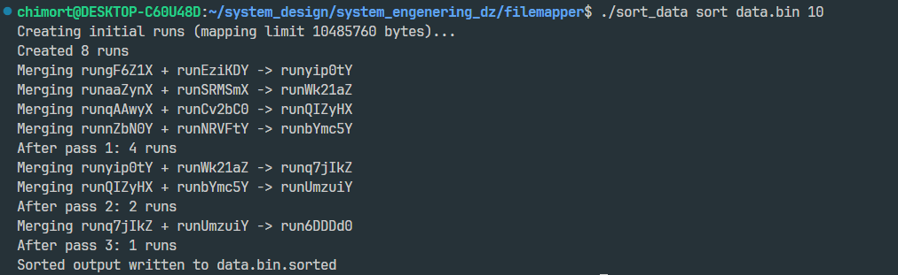

Отчёт по заданию

Сортировка больших бинарных файлов с ограничением по виртуальной памяти

------------------------------------------------------------------------

1. Постановка задачи

Дан большой бинарный файл, содержащий 64-битные целые числа (uint64_t),
записанные в двоичном виде.

Необходимо реализовать программу, которая:

-   сортирует файл по возрастанию;
-   использует memory mapping (mmap);
-   не превышает заданный лимит виртуальной памяти;
-   если лимит не задан — использует 1/10 размера файла.

Дополнительно требовалось реализовать: - генератор тестового файла; -
утилиту проверки корректности сортировки.

------------------------------------------------------------------------

2. Теоретическая основа

2.1 Проблема сортировки больших данных

Если файл полностью помещается в оперативную память, его можно считать
целиком и отсортировать с помощью стандартного алгоритма (например,
std::sort).

Однако при работе с файлами, размер которых превышает доступную
оперативную память, такой подход невозможен.

В этом случае применяется алгоритм внешней сортировки (External Merge
Sort).

------------------------------------------------------------------------

2.2 Внешняя сортировка (External Merge Sort)

Алгоритм состоит из двух фаз.

Фаза 1 — Разбиение на отсортированные блоки (runs)

1.  Файл разбивается на части, размер которых не превышает допустимый
    объём памяти.
2.  Каждая часть считывается.
3.  Сортируется в оперативной памяти.
4.  Записывается во временный файл.

В результате получаем несколько отсортированных временных файлов (runs).

------------------------------------------------------------------------

Фаза 2 — Многопроходное слияние

1.  Отсортированные файлы объединяются попарно.
2.  Используется классический алгоритм merge из merge sort.
3.  На каждом шаге количество файлов уменьшается вдвое.
4.  Процесс повторяется до получения одного итогового файла.

------------------------------------------------------------------------

2.3 Почему используется mmap

Memory mapping позволяет:

-   отображать файл в адресное пространство процесса;
-   работать с файлом как с обычным массивом;
-   избежать лишних системных вызовов read;
-   использовать механизм подкачки страниц операционной системы.

ОС самостоятельно:

-   загружает страницы в память при обращении;
-   выгружает неиспользуемые страницы;
-   оптимизирует последовательное чтение.

Это даёт выигрыш по производительности по сравнению с lseek + read.

------------------------------------------------------------------------

3. Контроль памяти

В программе строго соблюдается ограничение на суммарный объём
отображения.

При создании начальных run:

Отображается не более mapping_limit байт.

При слиянии:

mapping_limit делится пополам: - половина для первого файла; - половина
для второго файла.

Таким образом гарантируется, что суммарное отображение не превышает
лимит.

------------------------------------------------------------------------

4. Оценка сложности

Обозначим:

N — количество элементов
K — количество начальных run

Временная сложность:

O(N log K)

Это классическая сложность внешней сортировки.

По операциям ввода-вывода алгоритм оптимален для дисковых данных.

------------------------------------------------------------------------

5. Реализация тестирования

Были реализованы следующие режимы работы программы:

Генерация тестового файла

Пример:

    ./sort_data generate data.bin 10000000 12345

Результат:

    Generated 10000000 numbers to data.bin

Файл содержит 10 000 000 случайных 64-битных чисел.

------------------------------------------------------------------------

Сортировка с лимитом 1024 МБ

    ./sort_data sort data.bin 1024

Вывод:

    Creating initial runs (mapping limit 80000000 bytes)...
    Created 1 runs
    Sorted output written to data.bin.sorted

Так как лимит достаточен для обработки всего файла за один проход, был
создан один run и дополнительных фаз слияния не потребовалось.

------------------------------------------------------------------------

Проверка результата

    ./sort_data check data.bin.sorted

Вывод:

    File appears sorted (10000000 elements).

Проверка выполняется также с использованием mmap и последовательного
сравнения элементов.

------------------------------------------------------------------------

Сортировка с малым лимитом (10 МБ)

    ./sort_data sort data.bin 10

Вывод:

    Creating initial runs (mapping limit 10485760 bytes)...
    Created 8 runs
    Merging runtsUCcK + runeK4lmK -> runWYXrxK
    Merging run8O2bTJ + run9VijVH -> runBqM8gM
    Merging run6XdKTH + runQTzo2I -> runu8nUMK
    Merging run1pVVRI + runsVHJQI -> runY3Lo9H
    After pass 1: 4 runs
    Merging runWYXrxK + runBqM8gM -> run7rYyEK
    Merging runu8nUMK + runY3Lo9H -> runFfu7NI
    After pass 2: 2 runs
    Merging run7rYyEK + runFfu7NI -> runUOFBUI
    After pass 3: 1 runs
    Sorted output written to data.bin.sorted

В данном случае:

-   было создано 8 начальных run;
-   выполнено 3 прохода слияния;
-   итоговый файл получен корректно.

